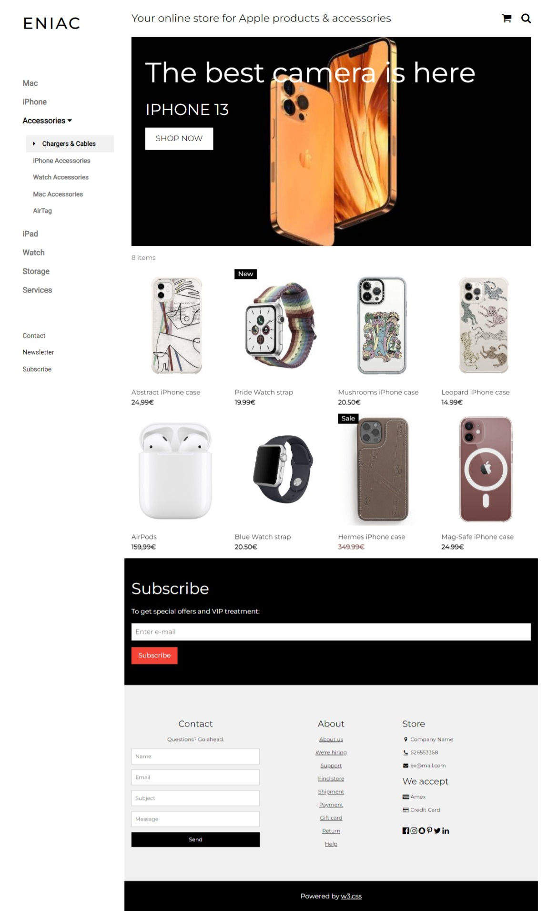
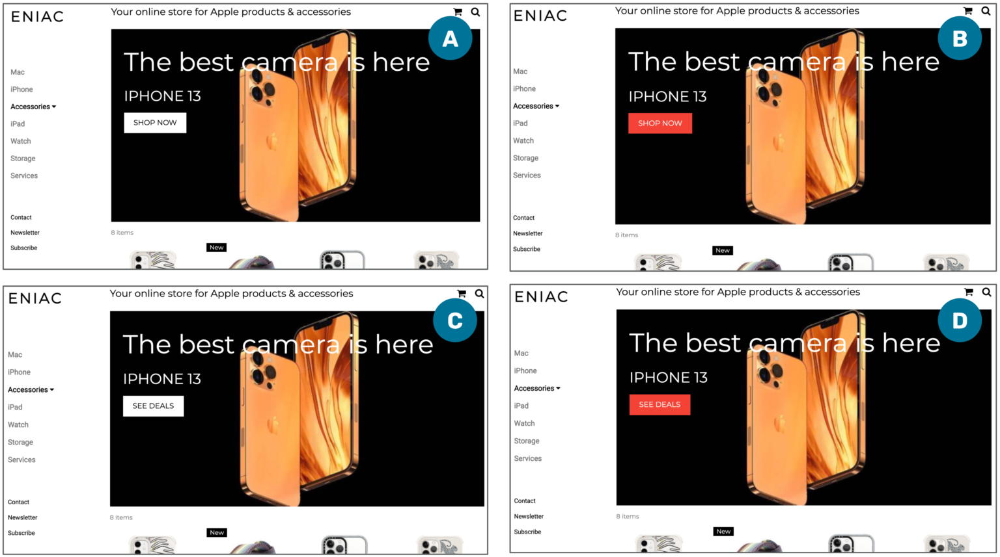
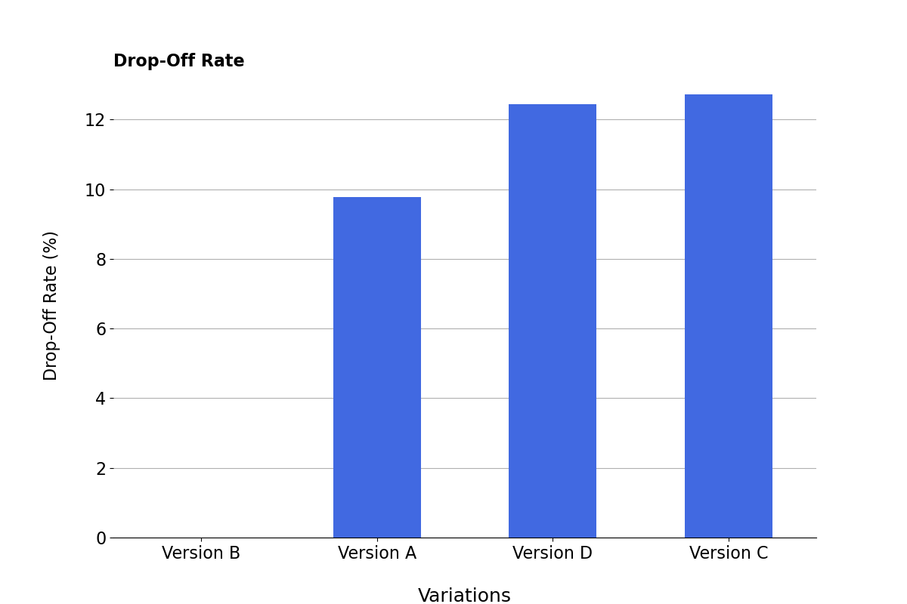
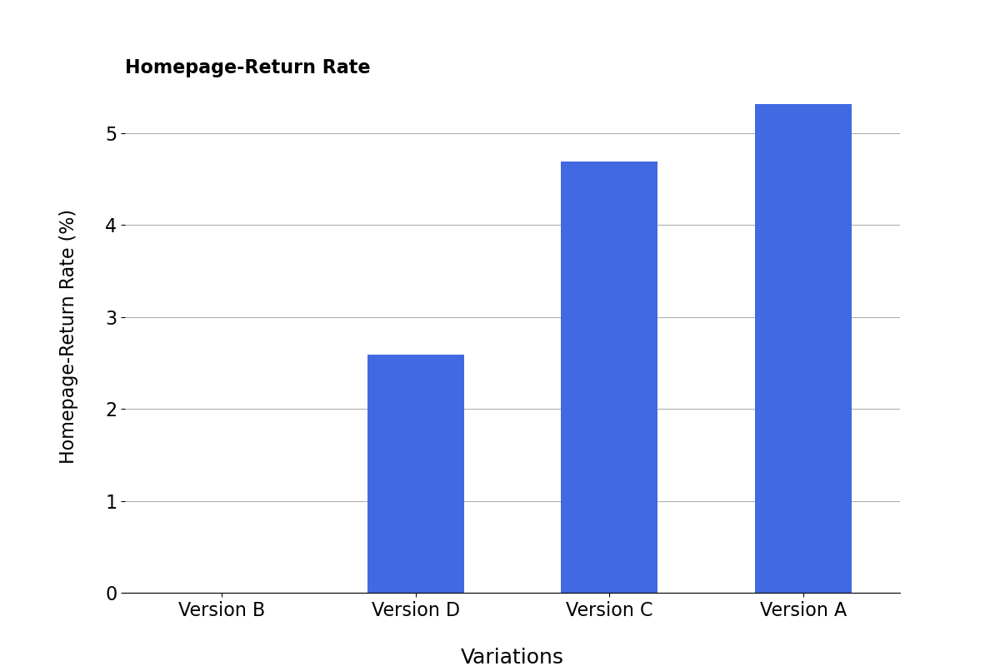

# A/B Testing Project For Eniac:
## DataScience Project 3 : WBS Coding School
This project is a part of my studies at DataScience Course which covers topics such as, Data Analysis, Python & Statistics.
## Objective: 
To find out which version of pages is better for business value.

## 💼 Case study: Eniac’s A/B Test

Details of this project are as follows:

Now that you’ve learned the basics of various hypothesis tests and how to evaluate them, it is time to return to Eniac’s A/B test. This is what the homepage currently looks like:

The white “SHOP NOW” button takes pride of place in the primary banner, but only attracts about 2% of users, as determined by click-through rate (CTR), a common term in Online Marketing which typically describes the number of clicks an ad receives divided by the number of times the ad is shown. Here, click-through rate is measured as the number of clicks a website element receives divided by the total number of visits on the website. The report from the team analysing the website shows the specific numbers and explains how they reacted to them:

*During the sample period from October 13, 2021 – October 20, 2121, which included 50,061 visits to the homepage, just under 2% of users clicked “SHOP NOW”. This did attract about twice the number of users as the “iPhone” link in the left sidebar, but contrasts with the surrounding banner itself, which gathered a CTR of roughly 3.5%. We asked ourselves if it may be visual features of the “SHOP NOW” button or if the text may feel simply too immediate a commitment to buying for users.*

In an A/B Test, one of the tasks that usually belongs to the UX team is to perform user research and develop a new version of the website element that needs to be tested. The team conducted an anonymous user survey, showing a de-branded mock-up of the homepage and asking “What do you think and feel seeing this ‘SHOP NOW’ button on an online retailer’s website?” A few responses are recorded below:

Holly, 32:

+ “I’m on a shopping site, so it seems pretty natural to me. I would probably click it if I knew which items it would take me to.”
Ed, 57:

+ “I like to do my research before I put anything in a basket. I’d like to see some product specs before I’m ready to ‘shop’.”
V., 16

+ “Seems a little unnecessary. I came here to shop, so why is the website telling me to shop?”
  
Based on the feedback and reviewing some successful colour choices from previous ad-campaigns, the UX team asked web-design for the three new variations.

Given all you’ve read above, how would you proceed to design an experiment that would improve the website? Before moving onto the next lesson, try to answer these questions by reviewing the resources on Experimental Design you read at the beginning of this project:

+ Would you include all suggested variants in the experiment (A, B, C and D)?
+ What is the “business value” that performing this experiment would add within the broader strategy of Eniac?
+ Which main metric would you choose to measure the success of a variant and perform the experiment on?
+ Which additional metrics would you choose to track?
+ How would you define the null and the alternative hypotheses?
+ What threshold for statistical significance would you set?
+ What is the minimum detectable effect (the smallest improvement you would care about) that you expect to detect?
+ Do you think this experiment would require a software engineering team to develop a custom platform, or could it be developed with external tools such as A/B Tasty?

## 🧩 Explore the data from the experiment
Finally, the decision was reached to test all four versions of the button:

White “SHOP NOW”
Red “SHOP NOW”
White “SEE DEALS”
Red “SEE DEALS”
The metrics that were deemed relevant enough to be tracked were the following:

+ Click-through rate (CTR) for the homepage. Amount of clicks on the button divided by the total visits to the page. Selected as a measure of the initial ability of a website element to lead users to interact with it.
+ Drop-off rate for the linked page. This metric represents the percentage of visitors who initiate a conversion process (such as a purchase or sign-up) but do not complete it. It serves as an indicator of how engaged users remain at any point in the conversion process. A lower drop-off rate is preferable, as it suggests a higher likelihood of users completing the desired action.
+ Homepage-return rate for the category pages. Measures how often users return to the homepage after clicking the button. Similarly to the drop-off rate, this metric helps us infer whether users are finding what they need after clicking the tested element. If they frequently return to the homepage, it suggests they might not be finding the desired information on the linked page. As such, the homepage-return rate serves as a useful indicator of how well the button leads users to the desired content. Ideally, we want to minimize the homepage-return rate, which would indicate that users are finding what they need on the first try.

While all the metrics will be relevant for the decision-making process, it was decided that for a version to be considered superior, there must be statistical significance in the click-through rate.

The hypotheses to be tested in the experiment are the following:

+ Null Hypothesis: all versions have the same CTR.
+ Alternative Hypothesis: there is a difference in the CTR for the different versions.
  
A typical statistical significance of 95% was chosen. Minimum detectable effect was set to 20%, it having been determined that even a small increase in the conversion pipeline would cover the costs of a small change to the website.

## Test Duration:
The test ran between November 2, 2021, and November 16, 2021. 

## 🧩 Perform a chi-square test
we will find out that some version(s) indeed performed better (or worse) than others.

## 🧩 After performing post-hoc tests, do you have a single variant winner?

Whenever that happens (getting significant results when comparing more than 2 variants), we perform a post-hoc test, consisting of running a new chi-square test for each pair of variants.

## 🧩 After performing post-hoc tests, do you have a single variant winner?

If the answer is still no, your options are:

+ Performing another experiment with the winning variants.
+ Analyse other metrics to understand better the behaviour of the users with each variant, and make the final decision based on that.

In this case, the website team decided to track drop-off rate and homepage-return rate as well (go back to the previous lesson for the definitions of these terms). To make things spicier, an error in their collection data process made it impossible to know these rates for version B:

## 🧩 FINAL QUESTION: With the result of your chi-square tests and this additional data: which version is your winner?

## Tools Used:
1. Google Colab Notebook.
2. Sample Siye Calculator. [AB Tasty Sample Size Calculator](https://www.abtasty.com/sample-size-calculator/)
3. Google Docs to summarize and answer the questions.
   
## Datasource:
We have used the database Eniac provided to analyse summarize.

## Key Learnings:
1. The basics of A/B testing. Creating hypotheses, what metrics to track, etc.
2. Data Analysis
3. Performing **Chi-square test**.
4. Performing **post-hoc test**.
5. Interpretation of results.

## Approach
The assessment of Magist involves a comprehensive evaluation based on the following criteria:

1) Answering the Questions: To understand the project comprehensively and collect the necessary data for the completion.
2) Analysing the Databases: Analyzing the data given for version A, B, C and D
3) Performing Chi-square test: Just to prove there is signficent difference between 1 or more versions as it was said.
4) Performing Post-hoc test: Consisting of running a new chi-square test for each pair of variants. 6 different comparisons.
5) Interpret the graphs for “drop-off rate” and “return to homepage rate”
6) Summerizing the Results: Achieving results using CTR, drop-off rates, return to homepage rates.

## Conclusion:
We have concluded:

1. The difference between Version A and Version C is not significent and might be due to chance.
2. Among the tested versions, Version A maximizes business value.

**Version A is the winner**

